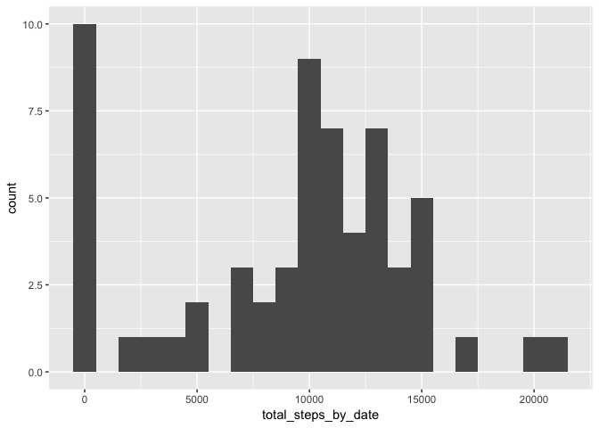
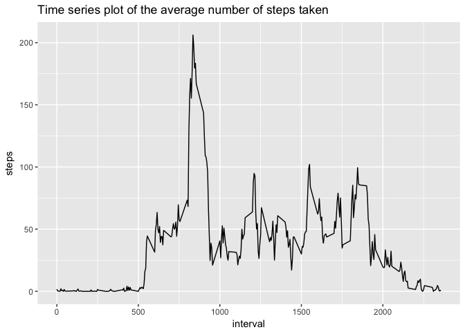
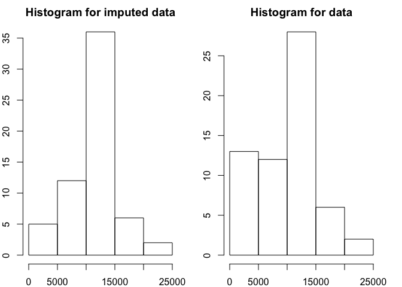

# Activity Monitoring Devices Analysis
Author : *Sahil Behl*

## Reproducible Research Peer Graded Assignment Project 1
Data Science Specialization, Coursera  

This project makes use of data from a personal activity monitoring device. This device collects data at 5 minute intervals through out the day. The data consists of two months of data from an anonymous individual collected during the months of October and November, 2012 and include the number of steps taken in 5 minute intervals each day.

# Data 
Dataset: [Activity monitoring data](https://d396qusza40orc.cloudfront.net/repdata%2Fdata%2Factivity.zip)
The variables of the dataset are:

* **steps**
* **date**
* **interval**

# Loading and Preprocessing Data

```r
unzip(zipfile = "activity.zip")
activity_mon_data <- read.csv('activity.csv')
```

## What is mean total number of steps taken per day?

```r
steps_by_date <- split(activity_mon_data$steps, activity_mon_data$date)
total_steps_by_date <- sapply(steps_by_date, sum, na.rm = TRUE)
library(ggplot2)
qplot(total_steps_by_date,binwidth=1000)
```

<!-- -->

```r
mean_steps <- mean(total_steps_by_date, na.rm = TRUE)
median_steps <- median(total_steps_by_date, na.rm =TRUE)
```
The `mean` and `median` of the total number of steps taken per day are 9354.2295082 and 10395 respectively.

## What is the average daily activity pattern?

```r
averages <- aggregate(x=list(steps = activity_mon_data$steps), by=list(interval = activity_mon_data$interval),
                      FUN=mean, na.rm=TRUE)
g <- ggplot(averages, aes(interval,steps))
g + 
  geom_line() +
  ggtitle("Time series plot of the average number of steps taken")
```

<!-- -->

```r
maximum <- max(as.integer(averages$steps))
int_max <- averages$interval[as.integer(averages$steps) == maximum]
```
The 5-minute interval, on average across all the days in the data set, containing the maximum number of steps is 835.

## Impute missing values. Compare imputed to non-imputed data.
Missing data needed to be imputed. Missing values were imputed by inserting the average for each interval.

```r
missing <- is.na(activity_mon_data$steps)
total_missing <- sum(missing)
```

The total number of NA values are 2304


```r
i<-1
imputed_data <- activity_mon_data
while(i<= nrow(imputed_data)){
  if(is.na(imputed_data[i,1]))
  {
    interval_missing <- imputed_data[i,3]
    imputed_data[i,1] <- averages[averages$interval == interval_missing,2]
  }
  i <- i + 1
}
steps_by_date <- split(imputed_data$steps, imputed_data$date)
imp_total_steps <- sapply(steps_by_date, sum, na.rm = TRUE)
par(mfrow = c(1,2), mar = c(2,2,2,2))
hist(imp_total_steps, main = "Histogram for imputed data",xlab = "Total steps")
hist(total_steps_by_date, main = "Histogram for data",xlab = "Total steps")
```

<!-- -->

```r
imp_mean_steps <- mean(imp_total_steps, na.rm = TRUE)
imp_median_steps <- median(imp_total_steps, na.rm =TRUE)
```
The `mean` and `median` of the total number of steps taken per day are 1.0766189\times 10^{4} and 1.0766189\times 10^{4} respectively.

```r
mean_diff<- imp_mean_steps - mean_steps
median_diff <- imp_median_steps - median_steps
total_step_diff <- sum(imp_total_steps) - sum(total_steps_by_date)
```
* The imputed data mean is 1.0766189\times 10^{4}
* The imputed data median is 1.0766189\times 10^{4}
* The difference between the non-imputed mean and imputed mean is 1411.959171
* The difference between the non-imputed median and imputed median is 371.1886792
* The difference between total number of steps between imputed and non-imputed data is 8.6129509\times 10^{4}. Thus, there were 8.6129509\times 10^{4} more steps in the imputed data.

## Are there differences in activity patterns between weekdays and weekends?

Created a plot to compare and contrast number of steps between the week and weekend. There is a higher peak earlier on weekdays, and more overall activity on weekends.  


```r
weekdays <- c("Monday", "Tuesday", "Wednesday", "Thursday",  "Friday")
imputed_data$dow = as.factor(ifelse(is.element(
                          weekdays(as.Date(imputed_data$date)),
                                                          weekdays),
                                    "Weekday", "Weekend"))
steps_by_interval_i <- aggregate(steps ~ interval + dow, imputed_data, mean)
library(lattice)
xyplot(steps_by_interval_i$steps ~ steps_by_interval_i$interval|steps_by_interval_i$dow, 
       main="Average Steps per Day by Interval",
       xlab="Interval",
       ylab="Steps",
       layout=c(1,2), 
       type="l")
```

<!-- -->

